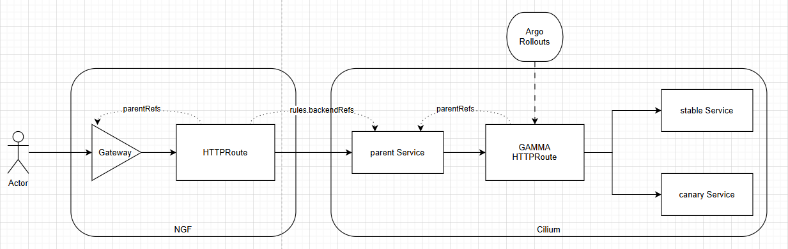

# Using Cilium for GAMMA Gateway API, fronted by NGINX Gateway Fabric for Gateway API with OTEL integration

## Why?

The end goal is to have Argo Rollouts for canary traffic split management with a GAMMA-based HTTPRoute, which can be provided by a Service Mesh like Cilium. <br/>
We'd want NGF to be the primary entry-point to the cluster since NGF has a good OpenTelemetry collector integration (it generates the root span), while Cilium doesn't (https://github.com/cilium/cilium/issues/41259). <br/>
The following picture presents this design.


## Prerequisites

A Kubernetes cluster. If you do not have one, you can create one using [kind](https://kind.sigs.k8s.io/), [minikube](https://minikube.sigs.k8s.io/), or any other Kubernetes cluster. This guide will use Kind.

## Step 1 - Create a Kind cluster where CNI will be Cilium

```shell
kind create cluster --config ./kind-cluster.yaml
```

## Step 2 - Install Cilium

I will use helm to install Cilium in the cluster (main CNI, Service Mesh with Gateway API), but before that we'll need to install Gateway API CRDs. You can also install Cilium using [cilium CLI](https://docs.cilium.io/en/stable/gettingstarted/k8s-install-default/#install-the-cilium-cli).

```shell
helm repo add cilium https://helm.cilium.io/
helm repo add metallb https://metallb.github.io/metallb
helm repo update
```

> [!NOTE]
> Cilium `v1.18.2` supports Gateway API `v1.2.0`, per [docs](https://docs.cilium.io/en/stable/network/servicemesh/gateway-api/gateway-api/).

```shell
kubectl apply -f https://raw.githubusercontent.com/kubernetes-sigs/gateway-api/v1.2.0/config/crd/standard/gateway.networking.k8s.io_gatewayclasses.yaml
kubectl apply -f https://raw.githubusercontent.com/kubernetes-sigs/gateway-api/v1.2.0/config/crd/standard/gateway.networking.k8s.io_gateways.yaml
kubectl apply -f https://raw.githubusercontent.com/kubernetes-sigs/gateway-api/v1.2.0/config/crd/standard/gateway.networking.k8s.io_httproutes.yaml
kubectl apply -f https://raw.githubusercontent.com/kubernetes-sigs/gateway-api/v1.2.0/config/crd/standard/gateway.networking.k8s.io_referencegrants.yaml
kubectl apply -f https://raw.githubusercontent.com/kubernetes-sigs/gateway-api/v1.2.0/config/crd/standard/gateway.networking.k8s.io_grpcroutes.yaml
```
```shell
helm install cilium cilium/cilium --version 1.18.2 \
     --namespace kube-system \
     --set image.pullPolicy=IfNotPresent \
     --set ipam.mode=kubernetes \
     --set cni.exclusive=false \
     --set kubeProxyReplacement=true \
     --set gatewayAPI.enabled=true \
     --wait
cilium status --wait
```

## Step 3 - Install MetalLB

```shell
helm install metallb metallb/metallb --version v0.15.2 \
    --namespace metallb-system \
    --create-namespace \
    --wait
```
```shell
ipv4Subnet=$(docker network inspect kind | jq -r '.[].IPAM.Config[] | select(.Subnet | contains(":") | not) | .Subnet')
subnetPrefix=$(echo $ipv4Subnet | cut -d. -f-3)

kubectl apply -f - <<__EOF__
---
apiVersion: metallb.io/v1beta1
kind: IPAddressPool
metadata:
  name: ippool
  namespace: metallb-system
spec:
  addresses:
    - ${subnetPrefix}.100-${subnetPrefix}.120
---
apiVersion: metallb.io/v1beta1
kind: L2Advertisement
metadata:
  name: ippool
  namespace: metallb-system
__EOF__
```

## Step 4 - Install NGINX Gateway Fabric

> [!NOTE]
> To keep closer to Cilium's Gateway API needs, we install version NGF `v1.6.2`, which supports Gateway API v1.2.1, per [CHANGELOG](https://github.com/nginx/nginx-gateway-fabric/blob/v1.6.2/CHANGELOG.md).

```shell
helm install ngf oci://ghcr.io/nginx/charts/nginx-gateway-fabric --version 1.6.2 \
    --namespace nginx-gateway \
    --create-namespace \
    --wait
```

## Step 5 - Create the services required for traffic split

Create three Services required for canary based rollout strategy

```shell
kubectl apply -f service.yaml
```

And two Deployments for canary and stable services to target

```shell
kubectl apply -f deployment.yaml
```

## Step 6 - Create the NGF Gateway and HTTPRoute pointing to a K8s service without Endpoints

We want the HTTPRoute to send traffic to a _parent_ K8s service (with no endpoints) that will also be managed by a GAMMA-based HTTPRoute

```shell
kubectl apply -f ngf-gateway.yaml
kubectl apply -f ngf-httproute.yaml
```

## Step 7 - Create the GAMMA HTTPRoute acting on the NGF HTTPRoute backend service

> [!IMPORTANT]
> For Cilium the K8s Services refs need to use `group: ""`. This is different than Linkerd, where `group: "core"` could be used.
  ```yaml
  apiVersion: gateway.networking.k8s.io/v1beta1
  kind: HTTPRoute
  spec:
    hostnames:
    - dummy  # does not count in GAMMA GatewayAPI yet, see https://github.com/kubernetes-sigs/gateway-api/issues/2885
    parentRefs:
      - group: ""
        name:
        kind: Service
        port:
    rules:
      - backendRefs:
          - group: ""
            name:
            kind: Service
            port:
  ```

Create a GAMMA [producer `HTTPRoute`](https://gateway-api.sigs.k8s.io/concepts/glossary/#producer-route) resource and connect it to a parent K8s service (using a canary and stable K8s services as backends)

```shell
kubectl apply -f cilium-httproute.yaml
```

## Step 8 - Observe HTTPRoutes being programmed

```console
$ kubectl get httproute gamma -o yaml | yq .status
parents:
  - conditions:
      - lastTransitionTime: "2025-10-14T11:01:07Z"
        message: Accepted HTTPRoute
        observedGeneration: 1
        reason: Accepted
        status: "True"
        type: Accepted
      - lastTransitionTime: "2025-10-14T11:01:07Z"
        message: Service reference is valid
        observedGeneration: 1
        reason: ResolvedRefs
        status: "True"
        type: ResolvedRefs
    controllerName: io.cilium/gateway-controller
    parentRef:
      group: ""
      kind: Service
      name: parent-service
      port: 80
```
```console
$ kubectl get httproute gw-ingress -o yaml | yq .status
parents:
  - conditions:
      - lastTransitionTime: "2025-10-14T10:59:27Z"
        message: The route is accepted
        observedGeneration: 1
        reason: Accepted
        status: "True"
        type: Accepted
      - lastTransitionTime: "2025-10-14T10:59:27Z"
        message: All references are resolved
        observedGeneration: 1
        reason: ResolvedRefs
        status: "True"
        type: ResolvedRefs
    controllerName: gateway.nginx.org/nginx-gateway-controller
    parentRef:
      group: gateway.networking.k8s.io
      kind: Gateway
      name: gw-ingress-ngf
      namespace: default
```

## Step 9 - Test traffic path

We observe NGF not being able to forward to the parent K8s service (which has no endpoints), in the data plane pod `nginx -T` output's `upstream` block for the service

```console
$ kubectl get gateway,httproute
NAME                                               CLASS   ADDRESS        PROGRAMMED   AGE
gateway.gateway.networking.k8s.io/gw-ingress-ngf   nginx   172.18.0.100   True         7m47s

NAME                                             HOSTNAMES                           AGE
httproute.gateway.networking.k8s.io/gamma                                            6m7s
httproute.gateway.networking.k8s.io/gw-ingress   ["api-dev.kind-test.foo.network"]   7m47s
$
$ curl http://api-dev.kind-test.foo.network --resolve api-dev.kind-test.foo.network:80:172.18.0.100
<html>
<head><title>503 Service Temporarily Unavailable</title></head>
<body>
<center><h1>503 Service Temporarily Unavailable</h1></center>
<hr><center>nginx</center>
</body>
</html>
```
```console
$ kubectl exec -it deploy/ngf-nginx-gateway-fabric -n nginx-gateway -c nginx -- nginx -T | rg "upstream default_parent-service" -A10
upstream default_parent-service_80 {
    random two least_conn;
    zone default_parent-service_80 512k;


    server unix:/var/run/nginx/nginx-503-server.sock;


}
```
```console
$ kubectl describe service parent-service
Name:                     parent-service
Namespace:                default
Labels:                   <none>
Annotations:              <none>
Selector:                 app=dummy
Type:                     ClusterIP
IP Family Policy:         SingleStack
IP Families:              IPv4
IP:                       10.96.36.131
IPs:                      10.96.36.131
Port:                     <unset>  80/TCP
TargetPort:               http/TCP
Endpoints:
Session Affinity:         None
Internal Traffic Policy:  Cluster
Events:                   <none>
$
$ kubectl describe service stable-service
Name:                     stable-service
Namespace:                default
Labels:                   <none>
Annotations:              <none>
Selector:                 app=stable-service
Type:                     ClusterIP
IP Family Policy:         SingleStack
IP Families:              IPv4
IP:                       10.96.6.202
IPs:                      10.96.6.202
Port:                     <unset>  80/TCP
TargetPort:               http/TCP
Endpoints:                10.244.1.104:5678,10.244.1.179:5678
Session Affinity:         None
Internal Traffic Policy:  Cluster
Events:                   <none>
$
$ kubectl describe service canary-service
Name:                     canary-service
Namespace:                default
Labels:                   <none>
Annotations:              <none>
Selector:                 app=canary-service
Type:                     ClusterIP
IP Family Policy:         SingleStack
IP Families:              IPv4
IP:                       10.96.255.108
IPs:                      10.96.255.108
Port:                     <unset>  80/TCP
TargetPort:               http/TCP
Endpoints:                10.244.1.59:5678,10.244.1.70:5678
Session Affinity:         None
Internal Traffic Policy:  Cluster
Events:                   <none>
```